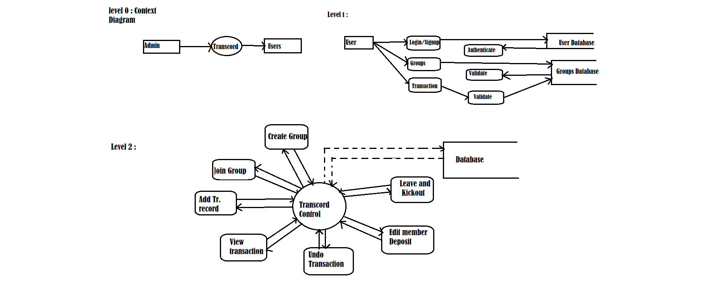
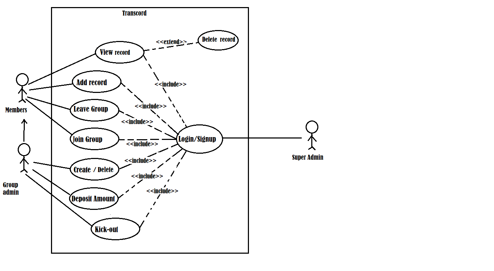
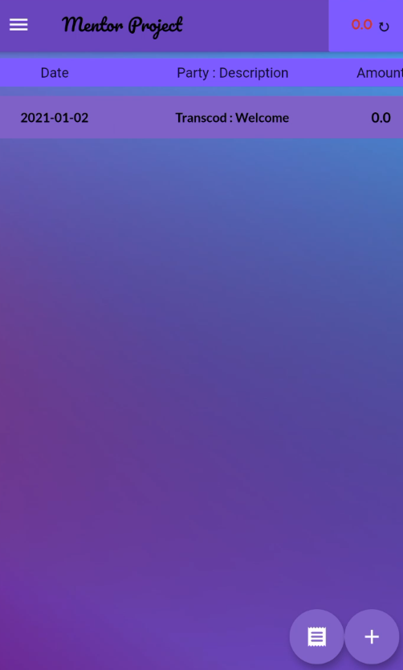
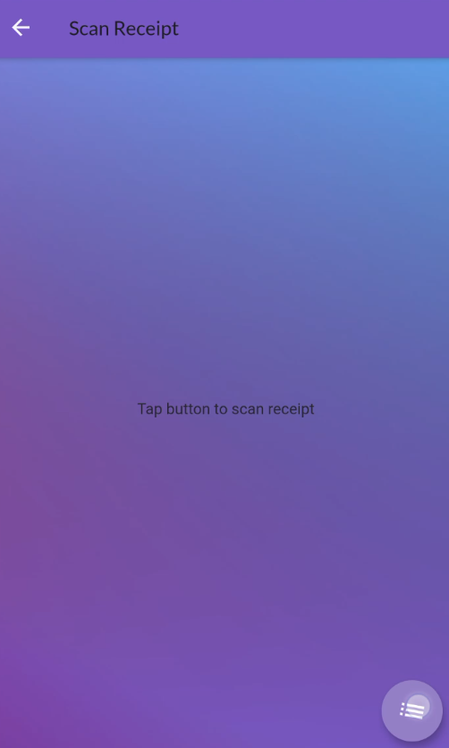

# TRANSCORD — Group Expense Manager  

**Timeline:** Jan 2022 – Mar 2022 

TRANSCORD is a **group expense management application** designed to simplify the process of handling shared finances. Whether it’s a trip, an event, or day-to-day group expenses, TRANSCORD ensures that deposits, transactions, and receipts are managed in one place with ease. 

---

## Features  

- **Create & Join Groups**: Instantly create or join any group. 
- **Deposit Management**: Group admins can set and edit deposit amounts. 
- **Transaction Recording**: Add transactions with descriptions and amounts; group balances are automatically updated. 
- **Receipt Scanning**: Upload/scan receipts containing multiple items — automatically extract and add expenses using **OCR**. 

---

## Tech Stack  

- **Frontend:** [Flutter](https://flutter.dev/) 
- **Backend:** [Firebase](https://firebase.google.com/) 
- **OCR Integration:** [Google OCR](https://cloud.google.com/vision) for receipt recognition 

---

## How It Works  

1. **Create or join a group** → Start managing shared expenses. 
2. **Add deposits & transactions** → Keep track of who paid what. 
3. **Scan receipts** → Extract multiple items at once using OCR, no need to add manually. 
4. **View balance updates** → The app keeps group records accurate and transparent. 

---

##  Screenshots & Demo

**DFD**

**Workflow**

**OCR demo 1** 
 

**OCR demo 2** 

